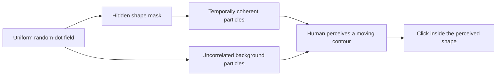
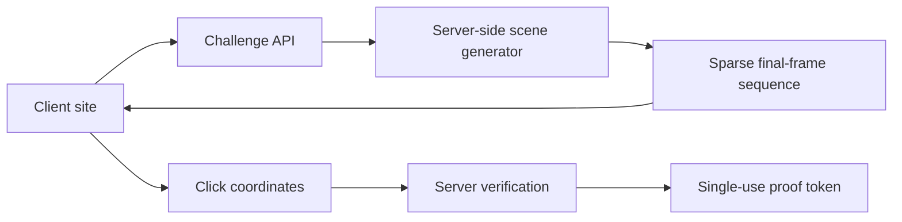

# WHOIZE CAPTCHA

[](LICENSE)

An experimental CAPTCHA in which the object is encoded in **time**, not in any
single image.

The prototype renders a field of visually identical random dots. A hidden
shape becomes perceptible only because a subset of those dots maintains
coherent motion across consecutive frames. Freeze the animation and the signal
should collapse back into noise.

> [!WARNING]
> This is a perception experiment and attack-benchmark foundation, not a
> production-ready bot protection system. Do not use it as the only security
> layer.

## The idea

Traditional visual CAPTCHAs place recognizable information directly in an
image. WHOIZE explores a different primitive:

- foreground and background dots share the same color, size, and approximate
  spatial density;
- the laboratory can regenerate the background continuously, while the
  server-video profile keeps it temporally stable for efficient compression;
- dots inside an invisible mask preserve part of their relative position;
- the visual system integrates that correlation over time and perceives a
  moving contour;
- a single frozen frame is intended to contain no reliable representation of
  the answer.

This is closer to a random-dot kinematogram or motion-defined contour than to
an OCR puzzle.



## Current prototype

The repository is an npm workspace with reusable public packages and two
research applications:

- `@whoize/captcha-core` — framework-independent configuration, presets, masks,
  and geometry;
- `@whoize/captcha-react` — the reusable React challenge component;
- `apps/demo` — the public CAPTCHA demo and Motion Lab;
- `apps/server-captcha` — the server-rendered challenge, verification, and
  one-time proof reference flow;
- `apps/captcha-versions` — runnable preserved implementations and comparison
  data for client Canvas, server APNG, server WebM, and sparse final-frame
  builds;
- `apps/control-plane` — an open reference implementation for shared research
  configuration.

The deployed site has four connected surfaces:

- `/` — a server-verified CAPTCHA flow with a protected demo action;
- `/versions` — a runnable archive comparing the client Canvas, server APNG,
  server WebM, and sparse final-frame implementations;
- `/lab` — the original perception laboratory for tuning the signal;
- `/admin` — an authenticated server control plane for shared CAPTCHA
  configuration.

The CAPTCHA surface deliberately tests one core interaction: can a person find
and click one moving shape whose evidence exists primarily between frames?

The version archive keeps earlier architectures runnable instead of replacing
them in place. Each entry records its actual resolution, dot density, frame
rate, traffic profile, server cost, security boundary, advantages, and known
limitations. This provides reproducible baselines for later `v1.x`
experiments.

Version `v1.3a` sends a four-second binary sequence of final occupied cells.
The server regenerates the background for every 640×360 frame, mixes it with
the private target, removes particle identities, sorts the final cells, and
gap/varint-encodes them. The browser only draws the decoded cells at 48 fps.
The sequence loops seamlessly after it has been downloaded once, while click
verification remains bound to the private server-side frame trajectory.

It includes:

- four procedural masks: circle, triangle, diamond, and star;
- randomized starting position and trajectory;
- server-side hit testing against the active mask and frame trajectory;
- one click per challenge, a 60-second expiry, and a three-attempt limit;
- explicit playing, verifying, passed, failed, expired, and locked states;
- a session-bound, short-lived proof consumed once by a protected endpoint;
- a true freeze-frame control;
- optional answer reveal for debugging;
- presets plus controls for density, dot size, signal coherence, speed, and
  frame rate;
- session accuracy, response-time median, and click-error history;
- responsive desktop and mobile layouts.

The control plane can change motion parameters, shape size and availability,
challenge duration, attempt limits, retry timing, proof lifetime, and
post-success behavior. Draft settings can be tested against the embedded
preview before publication. Published revisions are stored in a private Vercel
Blob, served through a read-only API, and picked up by all CAPTCHA clients
without a rebuild. Writes require an owner password and an authenticated,
signed HttpOnly session. Every publication also creates an immutable audit
record.

The public demo now runs `v1.3a`. The server builds a four-second sparse
final-frame sequence at 640×360 and 48 fps with a fresh background on every
frame. The browser receives only sorted occupied cells plus non-secret timing
metadata; it never receives the mask, trajectory, particle identities, or
random seeds. Click verification uses the exact sparse frame, freezes the
result for feedback, and returns a session-bound proof that the protected demo
action can consume exactly once.
Challenge and proof records use D1 when a Cloudflare binding is present,
private Vercel Blob storage on Vercel, and memory only in local development.

## Repository structure

```text
WHOIZE-CAPTCHA/
├── packages/
│   ├── captcha-core/
│   └── captcha-react/
├── apps/
│   ├── demo/
│   ├── control-plane/
│   └── server-captcha/
├── app/                    # thin Next.js route adapters
├── docs/
└── tests/
```

See [Architecture and repository boundary](docs/architecture.md) for the
public/private split and [React integration](docs/integration.md) for SDK usage.
The private `WHOIZE-CLOUD` repository is reserved for production-only
verification policy, adaptive risk scoring, attack telemetry, secrets, and
infrastructure—not the reproducible research mechanism or this reference
protocol.

## Run locally

Requirements:

- Node.js `>=22.13.0`
- npm

```bash
git clone https://github.com/EgrIkvlv/WHOIZE-CAPTCHA.git
cd WHOIZE-CAPTCHA
npm install
npm run dev
```

Open [http://localhost:3000](http://localhost:3000). The control plane is
available at [http://localhost:3000/admin](http://localhost:3000/admin).

Server Control Plane variables:

```bash
BLOB_READ_WRITE_TOKEN=
CONTROL_PLANE_PASSWORD=
CONTROL_PLANE_SESSION_SECRET=
```

Keep their values in `.env.local` for development and in encrypted hosting
environment variables for production. Never commit them.

Useful commands:

```bash
npm run dev     # start the interactive lab
npm run lint    # run static checks
npm test        # build and verify server-rendered output
npm run build   # create a production build
```

## How the field is generated

Each trial chooses a mask, radius, position, and velocity. The renderer then
estimates how many particles the mask should contain at the selected global
density.

Background particles are sampled uniformly outside the current mask on every
paint in Motion Lab. The server-video renderer instead reuses a deterministic
background field across frames so VP8 can encode the full-density stream
efficiently. The sparse-frame renderer restores a fresh background on every
frame without sending the mask or particle roles to the browser. Target
particles are sampled uniformly inside the mask. A configurable percentage
remains stable relative to the moving center; the rest is resampled. Those
stable particles are the temporal signal.

The canvas never draws a conventional filled silhouette during a normal
challenge. “Show answer” adds an explicit outline only as a laboratory aid.

## What this does—and does not—defend against

The prototype raises the cost of:

- single-screenshot solvers;
- ordinary OCR;
- static image classification;
- bots that do not collect consecutive frames.

It is **not** assumed to resist a purpose-built solver. Likely attacks include:

- frame differencing;
- temporal averaging;
- optical flow;
- motion segmentation;
- coherent-particle clustering;
- object tracking;
- direct analysis or modification of client-side code.

The long-term research question is therefore not “is the animation impossible
for a machine?” It is:

> Can we find parameters that humans solve quickly and reliably while forcing
> automated solvers to perform materially more expensive temporal analysis?

## Planned experiments

1. Record human success rate, response time, and click error across parameter
   combinations.
2. Build baseline solvers using frame differencing and optical flow.
3. Compare frozen-frame, frame-stack, and full-video attacks.
4. Add multiple shapes and target selection.
5. Add “track and click the final position” challenges.
6. Benchmark the server-rendered reference flow against purpose-built solvers.
7. Add rate limiting and private adaptive risk policy.
8. Design a non-motion accessibility alternative.

## Production architecture direction

The reference deployment no longer exposes masks, trajectories, or answers in
browser state. It uses server-side generation with short-lived challenge
records and one-time verification tokens.



CAPTCHA should remain one signal inside a broader anti-abuse system that also
uses rate limits, session risk, replay prevention, and business-level controls.
Sensitive operational controls belong in private `WHOIZE-CLOUD`; this public
repository provides the research engine, SDK, protocol documentation, and a
reviewable server-verification reference.

## Accessibility

Motion-based challenges can exclude people with low vision, vestibular
disorders, attention differences, or reduced-motion preferences. A production
system needs a genuinely different route—such as email verification, a
passkey, or another account-bound check—not merely an audio version of the same
puzzle.

## Project status

Early research prototype. The visual mechanism and UI are functional; no claim
of bot resistance has been established yet.

Issues, attack ideas, solver experiments, and human-testing results are
welcome.

## License

Released under the [MIT License](LICENSE). You may use, modify, distribute, and
sell copies of the software as long as the copyright and license notice is
preserved.
