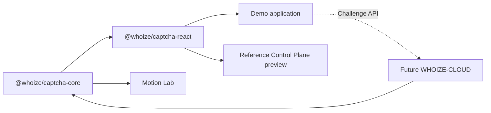

# Architecture and repository boundary

WHOIZE is an open CAPTCHA research project. Its public source is intentionally
reproducible; production security must not depend on hiding browser code.

## Public repository: WHOIZE-CAPTCHA

```text
WHOIZE-CAPTCHA/
├── packages/
│   ├── captcha-core/       framework-agnostic masks, geometry, config, presets
│   └── captcha-react/      reusable React challenge component
├── apps/
│   ├── demo/               public product demo and Motion Lab
│   └── control-plane/      open reference configuration service
├── app/                    thin Next.js routes and API adapters
├── docs/                   architecture, integration, and research notes
└── tests/                  rendered application contract tests
```

The public repository should remain sufficient to reproduce experiments, build
baseline solvers, inspect the interaction, and integrate the research component.

## Future private repository: WHOIZE-CLOUD

Create `WHOIZE-CLOUD` when the project gains its first production-only security
signal. It should contain only operational policy and hosted-service code:

```text
WHOIZE-CLOUD/
├── services/
│   ├── challenge-api/
│   ├── verification-api/
│   ├── risk-engine/
│   └── telemetry/
├── control-plane/
├── infrastructure/
└── runbooks/
```

Private responsibilities:

- server-side challenge records, answers, and one-time proof redemption;
- adaptive anti-bot heuristics and risk scoring;
- attack telemetry, rate limits, abuse rules, and operational thresholds;
- production identity, audit access, deployment configuration, and secrets.

The private service may depend on the public packages. The public packages must
never depend on private source.

## What remains public

The current Control Plane is a reference configuration service, not a security
boundary. Publishing its code is useful for reproducibility and does not expose
credentials: production values live only in hosting environment variables.

When challenge verification becomes server-authoritative, the public repository
should retain a small reference verifier and protocol documentation. The hosted
service can add private adaptive policy around that protocol.

## Dependency direction



No production secret, answer, risk rule, or customer data belongs in
`WHOIZE-CAPTCHA`.
